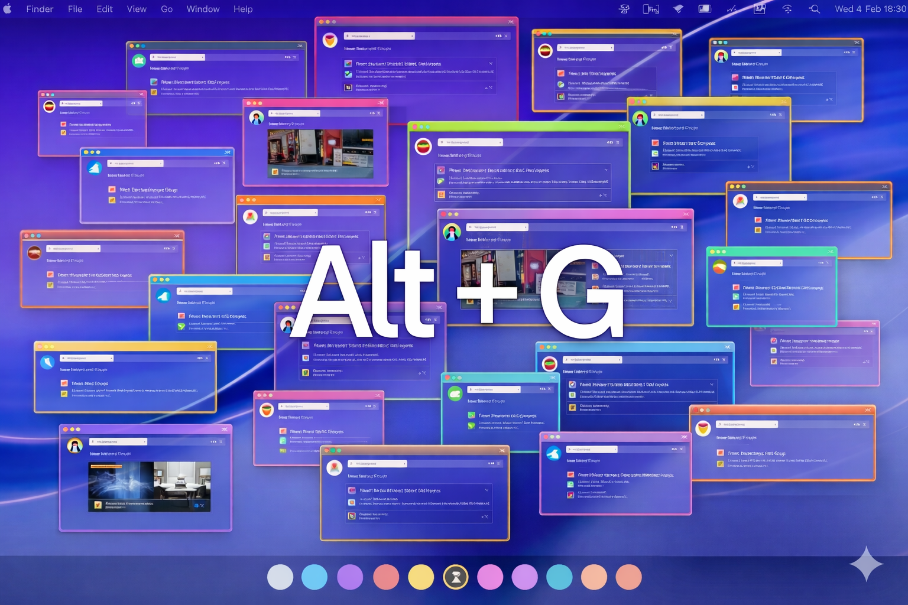

# 🗂️ TabGroup Selector

**Navigate your browser like a pro.** TabGroup Selector brings the iconic macOS `Cmd + Tab` window-switching experience directly to your Chrome Tab Groups.
---

---

## 🚀 Overview

If you use Chrome Tab Groups, you know the struggle of clicking through tabs to find the right group. **TabGroup Selector** eliminates the friction. With a simple keyboard shortcut, you get a sleek, glassmorphic overlay that lets you cycle through your active groups and jump to them instantly.

## ✨ Key Features

* **Keyboard-Driven UI**: Switch groups without ever lifting your hands from the keyboard.
* **macOS Aesthetic**: A beautiful, centered overlay with background blur (glassmorphism).
* **Visual Recognition**: Displays your Tab Group titles and their assigned Chrome colors.
* **Smart Activation**: Hold the modifier key to cycle, and release to "teleport" to the selected group.
* **Privacy Focused**: Runs locally; see **Permissions note** below for why **`bookmarks`** access is requested (Chrome saved tab groups synced as bookmark folders).

## ⚙ Permissions note

Chrome does not always expose **saved-but-not-open** tab groups via `tabGroups`; the switcher merges **live Chrome groups**, **persisted registry rows**, and **bookmark-bar folders** Chrome uses for **Saved Tab Groups** (flat folders on the bookmarks bar whose direct children are all normal links — user-created folders can match that shape and may appear as extra rows). Only those URLs are read to build restorable rows. Removing **`bookmarks`** would hide synced saved groups that never surface as live `tabGroups` on some devices.

## 🛠️ How to Use

1.  **Open the Switcher**: Press and hold `Alt + G` (Windows/Linux) or `Option + G` (macOS).
2.  **Cycle Through**: While holding `Alt` (or `Option`), tap `G` to move the selection highlight.
3.  **Confirm**: Release the `Alt` (or `Option`) key. The extension will automatically take you to the first tab in that group.

---

## 📦 Installation

### For Users (Manual Installation)
Since this is an open-source productivity tool, you can install it manually in seconds:

1.  **Download** the latest release ZIP from the [Releases](https://github.com/your-username/tabgroup-selector/releases) page.
2.  **Extract** the folder to a safe location on your computer.
3.  Open Chrome and go to `chrome://extensions/`.
4.  Enable **Developer Mode** (toggle in the top right).
5.  Click **Load unpacked** and select the `dist` (or build) folder you extracted.

---

## 👨‍💻 Development

This project is built using the `chrome-extension-boilerplate-react-vite`.

### Tech Stack
* **Framework**: React 18
* **Build Tool**: Vite
* **Styling**: Tailwind CSS
* **Language**: TypeScript

### Local Setup
1.  Clone the repository:
    ```bash
    git clone [https://github.com/amitos80/chrome-extension-tab-group-selector](https://github.com/amitos80/chrome-extension-tab-group-selector)
    ```
2.  Install dependencies:
    ```bash
    pnpm install
    ```
3.  Build the project:
    ```bash
    pnpm build
    ```
4.  Load the `dist` folder as an "Unpacked Extension" in Chrome.

### Development: Premium & auto-grouping

**Billing (production):** New installs get a **14-day Premium trial**. After that, users purchase **$18/year** or a **lifetime** license via **Lemon Squeezy**. **Launch offer:** **$24.99 lifetime** for the **first 2,500** buyers, then **$37** — configure separate checkout URLs in `.env` and set `CLI_CEB_LS_LIFETIME_LAUNCH_ACTIVE=false` once the launch tranche is sold out in Lemon Squeezy.

**Development override:** The popup and Options show a **Premium (manual)** toggle **only when built with `import.meta.env.MODE === 'development'`** (`pnpm dev`). Production builds hide it.

**About `.env` and `CLI_CEB_DEV`:** Running **`pnpm build`** executes `pnpm set-global-env` with no arguments. That script **rewrites the CLI section** of `.env` and sets `CLI_CEB_DEV=false` by design. Use **`pnpm dev`** for the developer Premium toggle.

**Lemon Squeezy env vars** (see `.env.example`): `CLI_CEB_LS_API_KEY`, yearly/lifetime checkout URLs, **`CLI_CEB_LS_CHECKOUT_LIFETIME_LAUNCH_URL`** ($24.99 launch), **`CLI_CEB_LS_LIFETIME_LAUNCH_ACTIVE`**, variant ids for yearly, standard lifetime, and launch lifetime.

### Free tier vs Premium

- **Switcher list:** Without Premium you only see **three** tab groups when the overlay opens (no search). **Typing in search** lists **all matching** groups among your full set — plus **Subscribe** / **Lifetime** actions when you have more than three groups.
- **Popup:** Appearance and **new-tab switcher** controls are Premium-only — free installs stay on **light** theme here and cannot enable **show switcher on new tab**. **Auto-grouping** can be turned on or off here when Premium is active (`autoGroupingPreferenceStorage`); free tier sees the toggle disabled.
- **Session snapshots:** Premium-only rolling backups of your workspace (**windows, tabs, tab-group titles, and Chrome group colors**). Data stays **on your device** in **extension local storage** (up to **30** checkpoints—nothing synced or uploaded). **Restoration from snapshot history is not available in this release.**
- **Cross-device workspaces (Premium, opt-in):** Extension-managed sync of **tab groups with saved URLs** is **off by default**. Enable **Sync tab groups across devices** in **Options** (beta — may be delayed or incomplete). Requires **Premium** and Chrome Sync; data is mirrored via **`chrome.storage.sync`** under **`synced_workspaces`**. Live/open groups on another device appear here as **closed restorable rows** until you Restore. Local URL capture is **not** Premium-gated; cloud push/pull require Premium **and** the toggle.
  - **Debugging:** In the extension service worker (`chrome://extensions` → Inspect views: **service worker**), filter the console by **`TABGROUP_SELECTOR`** to see **`[SYNC]`** (`chrome-extension/src/background/cross-device-sync.ts`), **`[REGISTRY]`** (reconcile + snapshot + Chrome `tabGroups` events), and **`[UI][GET_TAB_GROUPS]`** when the switcher asks for the list. Log lines with **`area: 'local'`** and **`applyingRemoteSync: false`** are normal (local registry writes scheduling outbound envelope push). **`applyingRemoteSync`** is **`true`** only while applying an inbound **`chrome.storage.sync`** payload for **`synced_workspaces`**—it prevents echo loops. Chrome’s native **tab-group sync** still surfaces live groups via `tabGroups`/`tabs`; extension sync adds **URL snapshots** for groups that never closed on the source machine.
- **`useEnforceNonPremiumDefaults`:** Persisted preferences are normalized when Premium is off (light theme, new-tab switcher off).

Premium tier is resolved in [`checkPremiumStatus`](chrome-extension/src/background/entitlements.ts) via trial, Lemon Squeezy license, or the development override.

## 📜 License
Distributed under the MIT License. See `LICENSE` for more information.

---
**Made for productivity enthusiasts.** If you like this project, give it a ⭐ on GitHub!