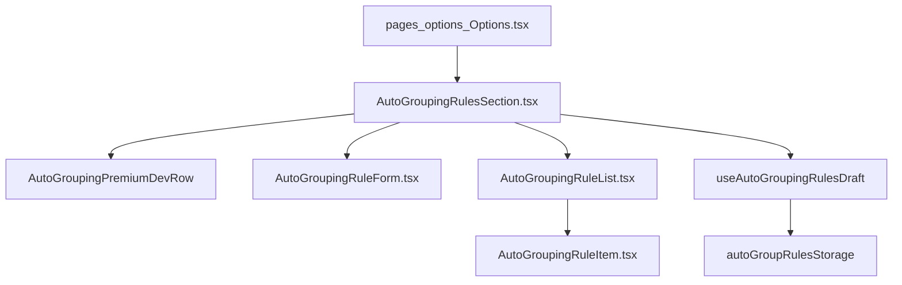

# Development plan: Auto-grouping Options UI (settings spec alignment)

## Objective

Align the extension **Options** experience for managing auto-grouping rules with the modular structure and engineering constraints defined in [`docs/development/specs/auto-grouping-tabs-settings.md`](../specs/auto-grouping-tabs-settings.md): files under **250 lines**, functions/hooks/components under **25 lines**, typed **Chrome-compatible** colors, and separation of **list / item / form / controller**.

This repo already implements rule CRUD in one large component ([`pages/options/src/components/AutoGroupingRulesSection.tsx`](../../../pages/options/src/components/AutoGroupingRulesSection.tsx)). The objective is **refactor for spec compliance**, not rewriting persistence or background behavior.

## Relationship to sibling work

- **Runtime / engine**: [`plans/auto-tab-grouping.md`](auto-tab-grouping.md), spec [`specs/auto-grouping-tabs.md`](../specs/auto-grouping-tabs.md).
- **This plan**: focuses only on **Options UI structure** vs [`specs/auto-grouping-tabs-settings.md`](../specs/auto-grouping-tabs-settings.md).

## Spec vs codebase mapping

| Spec concept | Spec template path | Repo (target / current) |
|--------------|---------------------|--------------------------|
| Main controller | `src/options/OptionsApp.tsx`, raw storage | [`pages/options/src/Options.tsx`](../../../pages/options/src/Options.tsx) composes section; **`autoGroupRulesStorage`** via `useStorage` — **keep** |
| Rule form | `RuleForm.tsx` | Extract **`AutoGroupingRuleForm.tsx`** |
| Rule list | `RuleList.tsx` | Extract **`AutoGroupingRuleList.tsx`** |
| Rule row | `RuleItem.tsx` | Extract **`AutoGroupingRuleItem.tsx`** |
| Premium gate | Banner + `checkPremiumStatus` | **`useStorage(premiumEntitlementStorage)`** (`manualPremiumUnlock`); Options text via i18n |
| Types / colors | `chrome.tabGroups.Color` | **`ChromeTabGroupColor`**, **`CHROME_TAB_GROUP_COLORS`** — [`packages/storage/lib/impl/auto-group-rules-storage.ts`](../../../packages/storage/lib/impl/auto-group-rules-storage.ts) |

Do **not** switch rules UI to raw `chrome.storage.local`/`autoGroupRules` keys from the illustrative spec snippet—that would regress typing and `liveUpdate` behavior.

## Target architecture

Suggested layout under **`pages/options/src/components/auto-grouping/`**:

- **`AutoGroupingRulesSection.tsx`** — thin orchestrator: section chrome, Premium gate copy, compose list + form, optional **`AutoGroupingPremiumDevRow`** strip.
- **`AutoGroupingRuleForm.tsx`** — pattern, group title, color `<select>`, Save/Cancel; validates non-empty; supports **add and edit** (spec shows add-only; editing is existing product behavior worth retaining unless removed explicitly).
- **`AutoGroupingRuleList.tsx`** — list wrapper + empty-state.
- **`AutoGroupingRuleItem.tsx`** — presentational row (swatch, titles, truncation, Edit/Delete); delete remains confirm dialog.
- **`useAutoGroupingRulesDraft.ts`** (optional under same folder or `hooks/`) — draft state (`editingId`, fields), `startAdd` / `startEdit` / `resetDraft` / `saveDraft` / `removeRule`, each small enough to satisfy **≤25 lines** rule (split helpers if needed).

[`Options.tsx`](../../../pages/options/src/Options.tsx) continues to import **`AutoGroupingRulesSection`** only (single import path; re-export barrel optional).

## Constraints checklist (during implementation PR)

1. Each **implementation file** in scope **\< 250 lines** ([`auto-grouping-tabs-settings.md`](../specs/auto-grouping-tabs-settings.md) § Strict Code Design Constraints).
2. Each **function / hook / component** body **≤ 25 lines** — split primitives or helpers.
3. Colors: **`CHROME_TAB_GROUP_COLORS`** / **`ChromeTabGroupColor`** only.
4. Rules persistence: **`autoGroupRulesStorage.setRules`** (+ `useStorage` subscription); no ad-hoc `chrome.storage.local` for rules arrays.
5. **i18n**: [`packages/i18n/locales/en/messages.json`](../../../packages/i18n/locales/en/messages.json) — reuse existing keys; add only when copy gaps appear.

## Out of scope

- Matcher / handler / manifest changes.
- Dedicated second Options page URL (still one **`options`** host page).
- URL pattern “live test” wiring to `isUrlMatch` in Options UI (defer).

## Risks & mitigations

| Risk | Mitigation |
|------|-------------|
| Regress Premium gate / dev toggle UX | Preserve behavior in **`AutoGroupingRulesSection`** skeleton; QA per tasks checklist |
| LOC churn while splitting | Barrel import from `components/auto-grouping/index.ts`; thin section first then extract |
| 25-line limit friction | Dedicated hook + dumb presentational leaves |

## Success criteria

- User-visible Options auto-group behavior **unchanged** (Premium gate, dev toggle, CRUD/edit, warnings, persistence order).
- All new/edited TS/TSX files respect **\<250 LOC** file and **≤25 LOC** units (verified in review).
- **`pnpm run build`** and ESLint on touched paths **pass**.
- After merge, capture outcome in **`docs/development/summaries/auto-grouping-tabs-settings.md`** per standard workflow ([`summaries/auto-tab-grouping.md`](../summaries/auto-tab-grouping.md) pattern).

## Tasks

Detailed breakdown: [`docs/development/tasks/auto-grouping-tabs-settings.md`](../tasks/auto-grouping-tabs-settings.md).
