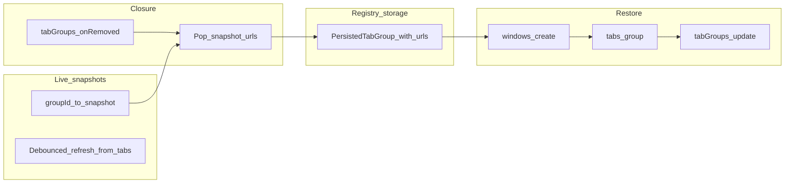

# Development plan: Closed tab groups — URL snapshot and reconstruction

## Objective and current situation

**Objective:** Restore closed tab groups with their original tabs by persisting URL lists while groups are open and rebuilding groups via `chrome.windows.create` + `chrome.tabs.group`, as described in [chrome_tabgroups_workaround.md](../../../chrome_tabgroups_workaround.md).

**Current situation:**

- The registry persists metadata (`title`, `color`, `tabCount`) but not tab URLs.
- `RESTORE_CLOSED_GROUP` creates a single `about:blank` tab and applies title/color only.
- Chrome provides no `tabGroups.restore()`; after closure, `groupId` is invalid and `tabGroups.onRemoved` fires too late to query URLs.

## Technical approach

### Option A — Persist snapshots only at closure

Promote a **live in-memory snapshot** `(title, color, urls)` keyed by `groupId` into the persisted closed row when `tabGroups.onRemoved` fires.

**Pros:** Minimal storage churn; matches Approach B in the workaround doc.

**Cons:** Requires RAM snapshots; lost if the service worker terminates without re-warming (mitigated by warming open groups on startup).

### Option B — Persist URL arrays on every navigation into `chrome.storage`

**Pros:** Survives worker kills without re-warm.

**Cons:** High write volume and quota pressure.

### Option C — Use `chrome.sessions.getRecentlyClosed()` to rebuild URLs

**Pros:** Uses Chrome session data.

**Cons:** Tab groups are fragmented into per-tab session entries; unreliable reconstruction.

### Chosen approach

**Option A**, with **startup warming**: refresh snapshots for all open groups after init sync so native closures shortly after load still capture URLs when possible.

## Architecture design

**Modules:**

- [`packages/storage/lib/impl/all-tab-groups-registry-storage.ts`](../../../packages/storage/lib/impl/all-tab-groups-registry-storage.ts) — `PersistedTabGroup.urls`, migration defaults, `markClosedFromRemovedGroup(..., urls?)`.
- [`chrome-extension/src/background/tab-group-live-snapshots.ts`](../../../chrome-extension/src/background/tab-group-live-snapshots.ts) — debounced snapshot refresh, pop on removal, warm on init.
- [`chrome-extension/src/background/restore-closed-group.ts`](../../../chrome-extension/src/background/restore-closed-group.ts) — URL normalization + `windows.create` restore pipeline.
- [`chrome-extension/src/background/tab-group-registry.ts`](../../../chrome-extension/src/background/tab-group-registry.ts) — wire snapshot pop into `onRemoved`.
- [`chrome-extension/src/background/index.ts`](../../../chrome-extension/src/background/index.ts) — delegate `RESTORE_CLOSED_GROUP` to restore helper.

**Manifest:** add [`windows`](../../../chrome-extension/manifest.ts) permission for `chrome.windows.create`.

## Implementation phases (priorities)

1. **Schema + migration** — Add `urls: string[]`; default missing arrays on load; extend snapshot-related APIs.
2. **Live snapshots** — Debounced listeners + startup warm; cap URLs per group (e.g. 50).
3. **Closure merge** — Pass popped URLs into `markClosedFromRemovedGroup`.
4. **Restore** — Implement new-window reconstruction; fallback to single `about:blank` when `urls` is empty or unusable.
5. **UI + docs** — Optional hint when URLs exist; update [`docs/AGENTS.md`](../../../docs/AGENTS.md); QA checklist in tasks doc.

## Success metrics

| Type | Metric |
|------|--------|
| Quantitative | Restore opens ≥95% of captured URLs for typical HTTPS-heavy groups (manual sample). |
| Quantitative | Cap enforced: ≤50 URLs per restore attempt (configurable constant). |
| Qualitative | Native “Close group” after snapshot warm yields restorable closed rows when URLs were readable (non-empty tabs). |
| Qualitative | Groups never observed while extension runs still restore as empty shell (`about:blank`), documented limitation. |

## Known limitations

- URLs not captured before first snapshot warm or after worker eviction without re-warm may yield empty `urls`.
- Restricted schemes (`chrome:`, `devtools:`, etc.) normalized away for restore safety (see tasks doc).
- Historical groups closed before this feature shipped retain `urls: []`.
