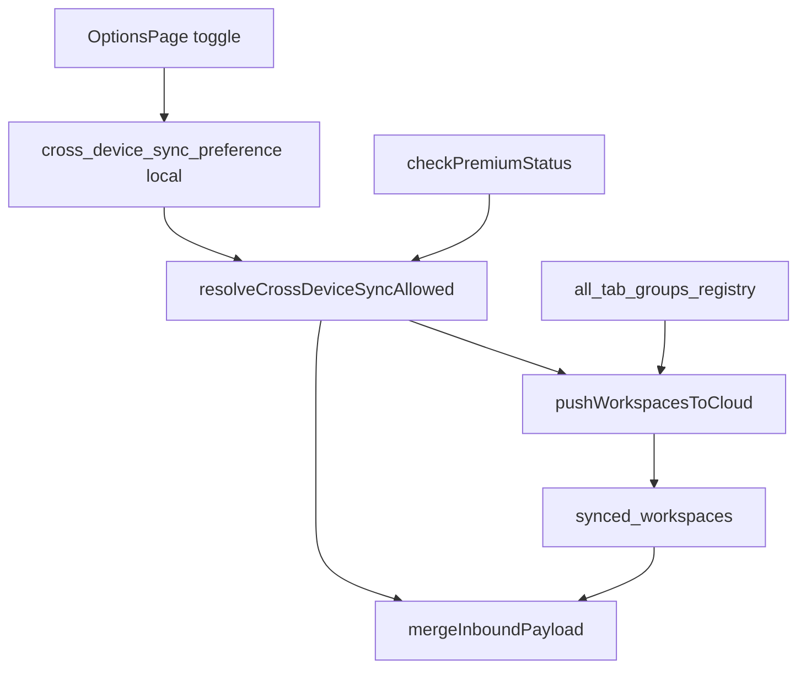

# Development plan: Cross-device sync toggle

## Objective and current situation

**Objective:** Let users **opt in** to extension-managed cross-device tab group sync. Default **off** on install/upgrade; when enabled (and Premium), existing sync behavior runs. Show a **beta** notice in Options.

**Spec (sync engine):** [`docs/development/specs/cross-device-sync.md`](../specs/cross-device-sync.md) · **Tasks:** [`docs/development/tasks/cross-device-sync-toggle.md`](../tasks/cross-device-sync-toggle.md)

**Current situation (pre-toggle):** [`cross-device-sync.ts`](../../../chrome-extension/src/background/cross-device-sync.ts) runs push/pull whenever **`checkPremiumStatus()`** is true. No user preference.

## Technical approach

| Option | Decision |
|--------|----------|
| Gate at init only | Rejected — cannot react to toggle without reload |
| Read preference on each push/pull | **Chosen** — matches auto-grouping handler pattern |
| Store toggle in `chrome.storage.sync` | Rejected — device-local consent |

### Preference

[`cross-device-sync-preference-storage.ts`](../../../packages/storage/lib/impl/cross-device-sync-preference-storage.ts):

- Key: **`cross-device-sync-preference-v1`**
- Field: **`crossDeviceTabGroupsSyncEnabled`** — default **`false`**

### Effective eligibility

Sync allowed iff **Premium** AND **toggle on**.

Local registry URL capture stays ungated.

### Toggle OFF

Stop push/pull; clear outbound debouncer; **do not** remove **`synced_workspaces`** from cloud.

### Toggle ON

Cold pull + immediate push (via preference `onChanged` on local storage).

## Architecture

## Success metrics

- Fresh install: toggle off; no `sync.set` until user enables + Premium.
- Enable toggle: cold pull + push without extension reload.
- Disable toggle: sync stops; cloud payload preserved.
- Builds: `@extension/storage`, `chrome-extension`, `@extension/options` pass.

## Companion documents

- Tasks: [`docs/development/tasks/cross-device-sync-toggle.md`](../tasks/cross-device-sync-toggle.md)
- Summary (post-ship): [`docs/development/summaries/cross-device-sync-toggle.md`](../summaries/cross-device-sync-toggle.md)
