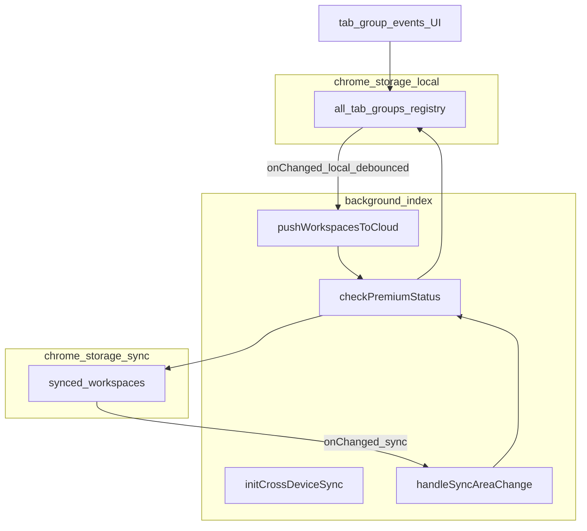

# Development plan: Cross-device sync

## Objective and current situation

**Objective:** Keep **restore-relevant, user-persisted tab-group workspace metadata** synchronized across Chrome profiles/devices using **`chrome.storage.sync`**, without any external server. **Premium-gated:** every push and pull path uses [`chrome-extension/src/background/entitlements.ts`](../../../chrome-extension/src/background/entitlements.ts) **`checkPremiumStatus()`**.

**Spec:** [`docs/development/specs/cross-device-sync.md`](../specs/cross-device-sync.md) · **Tasks:** [`docs/development/tasks/cross-device-sync.md`](../tasks/cross-device-sync.md)

**Hard exclusion:** **`sessionSnapshots`** / [`session-snapshots-storage`](../../../packages/storage/lib/impl/session-snapshots-storage.ts) remain **`chrome.storage.local` only** (quota + product).

**Current situation:** The canonical registry is [`allTabGroupsRegistryStorage`](../../../packages/storage/lib/impl/all-tab-groups-registry-storage.ts) (**`StorageEnum.Local`**, key **`all-tab-groups-registry-storage-key-v1`**). [`StorageEnum.Sync`](../../../packages/storage/lib/base/enums.ts) exists but is unused for this feature. There is no sync listener or minimized DTO yet.

## Quota constraints (blocking)

`chrome.storage.sync`: **~102 KB total**, **~8 KB per item**. The registry can hold up to [`MAX_REGISTRY_GROUPS`](../../../packages/storage/lib/impl/all-tab-groups-registry-helpers.ts) rows—**never** mirror the full registry.

1. **Minimized envelope** stored under spec key **`synced_workspaces`** (single JSON-serializable value).
2. **Byte-size guard** before **`chrome.storage.sync.set`**; on failure log and continue with local-only.
3. **MVP eligibility:** **closed** [`PersistedTabGroup`](../../../packages/storage/lib/impl/all-tab-groups-registry-types.ts) rows with **`urls.length > 0`**, ordered by **`lastSeenAt`**, trimmed until the envelope fits a **safe per-item budget** (under 8 KB).
4. **Phase 2 (optional):** explicit “pin to cloud” UX or **sharded** keys if product outgrows one item.

## Technical approach

- **DTO + pure merge** in [`packages/storage/lib/impl/tab-groups-sync-dto.ts`](../../../packages/storage/lib/impl/tab-groups-sync-dto.ts): **`SyncEnvelopeV1`**, **`buildEnvelopeFromRegistryGroups`**, **`parseSyncEnvelope`**, **`mergeRemoteRowsIntoLocalGroups`** (per-**`persistKey`** LWW using row **`u`** vs local **`lastSeenAt`**).
- **Registry API** [`allTabGroupsRegistryStorage.mergeRemoteSyncEnvelope`](../../../packages/storage/lib/impl/all-tab-groups-registry-storage.ts): single **`storage.set`** path through **`finalizeRegistryGroupsForPersistence`**; **does not** call sync push.
- **Background** [`chrome-extension/src/background/cross-device-sync.ts`](../../../chrome-extension/src/background/cross-device-sync.ts): **`initCrossDeviceSync`**, **`pushWorkspacesToCloud`** (exported for clarity), **`chrome.storage.onChanged`** for **`area === 'sync'`** (inbound) and **`area === 'local'`** for registry key (outbound debounce). **Module flag** **`applyingRemoteSync`** suppresses outbound push while applying remote merge (**loop prevention**).
- **Bootstrap:** [`chrome-extension/src/background/index.ts`](../../../chrome-extension/src/background/index.ts) calls **`initCrossDeviceSync()`** from **`initTabGroupRegistry().finally(...)`** so registry migrations settle before merges; **`initSnapshotScheduler()`** unchanged. **`initCrossDeviceSync`** registers **`chrome.storage.onChanged`** plus a **cold-start** **`chrome.storage.sync.get`** pull.

## Architecture

## Conflict resolution

**Per-`persistKey` last-write-wins** using sync row timestamp **`u`** vs local **`lastSeenAt`**. Remote row updates **only** when **`u` > `lastSeenAt`** (strict). New keys insert closed rows with device-neutral **`windowId: -1`**, **`chromeGroupId: null`**.

## Edge cases

- **Loop prevention:** inbound merge sets **`applyingRemoteSync`** so local **`onChanged`** does not schedule push.
- **Free tier:** no push, no merge apply.
- **Firefox / non-Chrome:** wrap **`chrome.storage.sync`** in try/catch; local remains source of truth.
- **Deletes:** MVP is **additive / LWW per row only**—omitting a group from sync does **not** delete local rows.

## Out of scope

- Session snapshot sync, full open-group **`chromeGroupId`** portability, backend services.

## Success metrics

- Two Chrome-signed-in profiles: closing a tab group with URLs on A eventually appears on B (Premium on both), without sync echo storms.
- Envelope stays under Chrome per-item quota in manual measurement.
- **`pnpm run build`** and ESLint pass.

## Companion documents

- Task breakdown: [`docs/development/tasks/cross-device-sync.md`](../tasks/cross-device-sync.md)
- Post-ship summary: [`docs/development/summaries/cross-device-sync.md`](../summaries/cross-device-sync.md) (after implementation)
