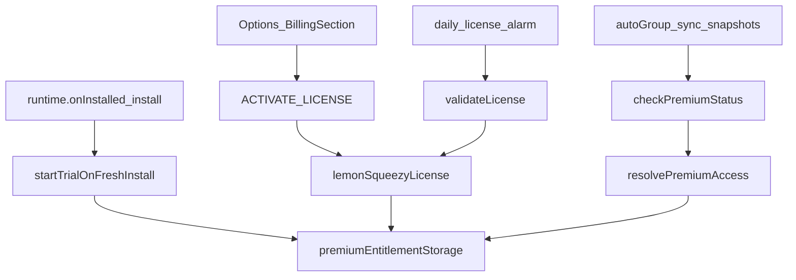

# Development plan: Free trial + Lemon Squeezy billing

## Objective and current situation

**Objective:** Ship a **14-day trial** (all Premium features), then enforce existing free-tier policy unless the user purchases **yearly ($18)** or **lifetime ($37)** via **Lemon Squeezy**.

**Spec:** [`docs/development/specs/free-trial-billing.md`](../specs/free-trial-billing.md) · **Tasks:** [`docs/development/tasks/free-trial-billing.md`](../tasks/free-trial-billing.md)

**Current situation:** Premium is dev-only [`manualPremiumUnlock`](../../../packages/storage/lib/impl/premium-entitlement-storage.ts). Upgrade UX uses `switcherPremiumUpgradeButton` in both switcher overlays.

## Technical approach

**Chosen:** Lemon Squeezy checkout + License API. Trial starts on fresh install only (`onInstalled` + `install`). Central resolver: [`resolvePremiumAccess`](../../../packages/storage/lib/impl/premium-access.ts). Background [`checkPremiumStatus`](../../../chrome-extension/src/background/entitlements.ts) uses resolver.

## Architecture

## Success metrics

- Fresh install: 14 days Premium; Options shows countdown.
- Post-trial without license: 3-group switcher cap, auto-group/sync/snapshots off.
- Valid yearly / lifetime license restores Premium.
- `pnpm run build` passes; no API secrets in repo.

## Companion documents

- Task breakdown: [`docs/development/tasks/free-trial-billing.md`](../tasks/free-trial-billing.md)
