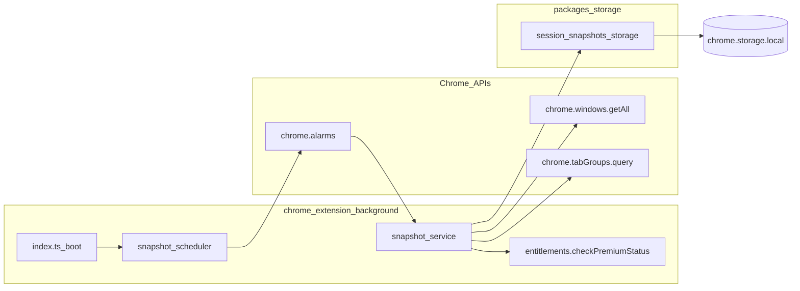

# Development plan: Session snapshots (scheduled capture)

## Objective and current situation

**Objective:** Capture a serialized backup of **all windows**, **tabs**, and **tab-group metadata** (title/color) at a fixed interval via **`chrome.alarms`**, only when Premium is enabled (`checkPremiumStatus()` / `premiumEntitlementStorage.manualPremiumUnlock`), persist history under **`sessionSnapshots`** in **`chrome.storage.local`**, and retain at most **30** snapshots.

**Specs:** [`docs/development/specs/session-snapshots.md`](../specs/session-snapshots.md) · **Companion tasks:** [`docs/development/tasks/session-snapshots.md`](../tasks/session-snapshots.md)

**Constraints (match project + spec intent):**

- Prefer **≤250 lines** per file and **≤25 lines** per function; split serializers/helpers where needed.

## Relationship to sibling work

This is distinct from **[`specs/auto-grouping-tabs-settings.md`](../specs/auto-grouping-tabs-settings.md)** (Auto-Grouping Options UI) and **[`specs/auto-grouping-tabs.md`](../specs/auto-grouping-tabs.md)** (matcher runtime).

## Technical approach — chosen architecture

Use **`@extension/storage`** for the snapshot history (same pattern as [`auto-group-rules-storage.ts`](../../../packages/storage/lib/impl/auto-group-rules-storage.ts)):

- **`packages/storage/lib/impl/session-snapshots-storage.ts`** — Types (`TabBackup`, `WindowBackup`, `SessionSnapshot`), storage key **`sessionSnapshots`**, `liveUpdate`, **`prependSnapshot`** with retention cap **30**.
- **`chrome-extension/src/background/snapshot-service.ts`** — Premium gate, `chrome.windows.getAll({ populate: true })`, `chrome.tabGroups.query`, serialization, **`prependSnapshot`**.
- **`chrome-extension/src/background/snapshot-scheduler.ts`** — Alarm lifecycle, **single `onAlarm` listener** guard, **`ensureAlarmRegistered`** idempotency.

**Rejected for this repo:** raw `chrome.storage.local` only — bypasses typed storage and `liveUpdate` consistency.

## Manifest and permissions

- Add **`alarms`** (required by spec).
- Add **`windows`** so **`chrome.windows.getAll`** is explicitly permitted alongside existing **`tabs`** / **`tabGroups`**.

Bootstrap: call **`initSnapshotScheduler()`** from [`chrome-extension/src/background/index.ts`](../../../chrome-extension/src/background/index.ts).

## Architecture

## Edge cases (spec)

- **Discarded tabs:** `title` / `url` fall back to `''`.
- **Internal / extension URLs:** do not strip `chrome://` or extension paths.
- **Empty-window filter:** omit windows whose serialized tab array is empty.

## Out of scope (v1 slice)

- Restore UI / replay of snapshots into live windows.

## Success metrics

- Premium **off** → no snapshots appended after alarms fire.
- Premium **on** → history grows newest-first; cap **30**; key **`sessionSnapshots`** present in local storage.
- **`pnpm run build`** and ESLint on touched paths pass.

## Tasks

See [`docs/development/tasks/session-snapshots.md`](../tasks/session-snapshots.md).
