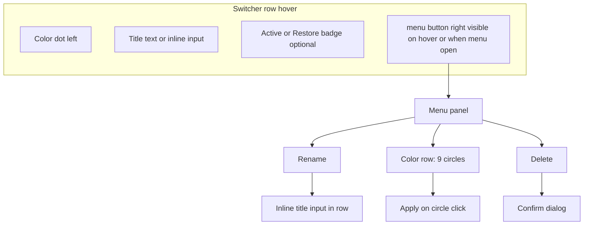
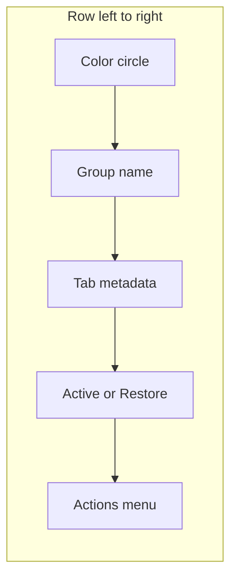
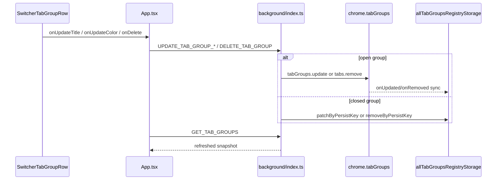

# Development plan: Switcher tab group row actions

## Objective and current situation

**Objective:** In the Tab Group Switcher overlay, let users **rename**, **change color**, and **delete** a tab group from a **row actions menu** (three-dot / kebab button) that appears on **row hover** at the **right edge** of each row.

**Scope:** Actions apply to **both open Chrome groups and closed registry rows**. Bookmark-saved rows (`bookmark-saved-tab-group:` persist keys) are out of scope for v1.

**Tasks:** [`docs/development/tasks/switcher-tab-group-row-actions.md`](../tasks/switcher-tab-group-row-actions.md)

**Current situation:**

- Rows are rendered inline in two near-duplicate files:
  - [`pages/content-ui/src/components/SwitcherOverlay.tsx`](../../pages/content-ui/src/components/SwitcherOverlay.tsx)
  - [`pages/new-tab/src/components/SwitcherOverlay.tsx`](../../pages/new-tab/src/components/SwitcherOverlay.tsx)
- Layout today: **color dot left**, title center, **Active / Restore badge right** — row click activates or restores.
- Existing background messages in [`chrome-extension/src/background/index.ts`](../../chrome-extension/src/background/index.ts): `GET_TAB_GROUPS`, `ACTIVATE_GROUP`, `RESTORE_CLOSED_GROUP`, `REMOVE_CLOSED_GROUP`.
- **No** update-title/color/delete handlers for open groups; **no** registry patch for closed-group metadata.
- Colors: [`packages/storage/lib/impl/tab-group-colors.ts`](../../packages/storage/lib/impl/tab-group-colors.ts) — 9 Chrome colors + `tabGroupColorCss()`.

## UX specification



| Action | Open group | Closed group |
|--------|------------|--------------|
| **Rename** | Inline edit → `chrome.tabGroups.update(id, { title })` | Inline edit → patch registry by `persistKey` |
| **Change color** | Menu sub-row of 9 swatches → `chrome.tabGroups.update(id, { color })` | Same swatches → patch registry by `persistKey` |
| **Delete** | Confirm → close all tabs in group (`chrome.tabs.remove`) → registry closes via `onRemoved` | Confirm → `REMOVE_CLOSED_GROUP` (existing) |

### Row layout

Each switcher row uses a fixed horizontal order (left → right):

```text
[ Color circle ]  [ Group name + tab metadata ]  …flex spacer…  [ Active / Restore badge ]  [ ⋮ menu ]
```

| Zone | Position | Content |
|------|----------|---------|
| **Color indicator** | **Left of the group name** | `h-4 w-4` filled circle using `tabGroupColorCss(row.color)`; always visible (not hidden on hover) |
| **Primary label** | Immediately to the right of the circle | Group title, or inline rename `<input>` in the same slot |
| **Secondary metadata** | Below the title | Tab count, Open/Closed, time ago |
| **Status badge** | Right side (before menu) | “Active” or “Restore” when applicable |
| **Actions menu** | Right edge | ⋮ button; visible on row hover or while menu/rename is open |

**Requirement:** The color circle must sit **directly to the left of the tab group name**, not on the right edge of the row. Color changes from the actions menu update this circle in place; the menu’s color swatches are separate picker controls, not the row indicator.



### Interaction rules

- **Hover:** Tailwind `group/row` shows ⋮ on the right; keep visible when menu is open or row is in rename mode.
- **Click isolation:** menu, swatches, and rename input use `stopPropagation()` so row click does not activate/restore the group.
- **Rename:** Replace title with `<input>`; **Enter** saves, **Escape** cancels, **blur** saves (same as Enter).
- **Delete confirm:** lightweight in-overlay modal (not `window.confirm`); destructive styling.
- **Color:** clicking a swatch applies immediately and closes menu; highlight current color with ring.
- **Keyboard:** preserve existing Arrow/Enter row navigation; menu button focusable; Escape closes menu, rename, or confirm.
- **Layout:** see **Row layout** above — color circle **left of the group name**; ⋮ menu on the **right edge**.

## Technical approach

### Options considered

| Option | Pros | Cons | Decision |
|--------|------|------|----------|
| **A — Inline in SwitcherOverlay** | Fewer files | Duplicates 270+ line overlays; violates 200-line file guideline | Rejected |
| **B — Shared UI + background handlers** | DRY row/menu components; testable mutations module | More files upfront | **Chosen** |

### Architecture



### New background messages

| Type | Payload | Response |
|------|---------|----------|
| `UPDATE_TAB_GROUP_TITLE` | `{ persistKey, title, chromeGroupId?: number }` | `{ success, error? }` |
| `UPDATE_TAB_GROUP_COLOR` | `{ persistKey, color, chromeGroupId?: number }` | `{ success, error? }` |
| `DELETE_OPEN_TAB_GROUP` | `{ chromeGroupId: number }` | `{ success, error? }` |
| `REMOVE_CLOSED_GROUP` | *(existing)* `{ persistKey }` | `{ success }` |

### Implementation files

| File | Role |
|------|------|
| [`chrome-extension/src/background/tab-group-mutations.ts`](../../chrome-extension/src/background/tab-group-mutations.ts) | Validate + call Chrome/registry |
| [`packages/storage/lib/impl/all-tab-groups-registry-storage.ts`](../../packages/storage/lib/impl/all-tab-groups-registry-storage.ts) | Add `patchByPersistKey(persistKey, { title?, color? })` |
| [`chrome-extension/src/background/index.ts`](../../chrome-extension/src/background/index.ts) | Wire message handlers |
| [`packages/ui/lib/components/SwitcherTabGroupRow.tsx`](../../packages/ui/lib/components/SwitcherTabGroupRow.tsx) | Row layout, hover menu, inline rename |
| [`packages/ui/lib/components/SwitcherRowActionsMenu.tsx`](../../packages/ui/lib/components/SwitcherRowActionsMenu.tsx) | ⋮ button + popover |
| [`packages/ui/lib/components/SwitcherConfirmDialog.tsx`](../../packages/ui/lib/components/SwitcherConfirmDialog.tsx) | Delete confirm modal |

Open-group delete: `chrome.tabs.query({ groupId })` → `chrome.tabs.remove(tabIds)`.

### Overlay integration

- Add props to `SwitcherOverlay`: mutation callbacks + refetch after success.
- Replace inline `.map()` row markup with `<SwitcherTabGroupRow />` in both overlay copies.
- Wire [`pages/content-ui/src/matches/all/App.tsx`](../../pages/content-ui/src/matches/all/App.tsx) and [`pages/new-tab/src/NewTab.tsx`](../../pages/new-tab/src/NewTab.tsx) to send new messages and call `GET_TAB_GROUPS`.

### i18n (menu + confirm only)

Add EN keys: `switcherRowActionsMenu`, `switcherRowActionRename`, `switcherRowActionDelete`, `switcherRowDeleteConfirmTitle`, `switcherRowDeleteConfirmBody`, `switcherRowDeleteConfirmOpen`, `switcherRowDeleteConfirmClosed`, `switcherRowRenamePlaceholder`, plus cancel/confirm button labels. KO optional follow-up.

## Implementation phases

| Phase | Priority | Content |
|-------|----------|---------|
| **P1** | P0 | Registry `patchByPersistKey` + `tab-group-mutations.ts` + background message handlers |
| **P2** | P0 | `SwitcherTabGroupRow`, `SwitcherRowActionsMenu`, `SwitcherConfirmDialog` |
| **P3** | P0 | Wire content-ui + new-tab `App.tsx` + both `SwitcherOverlay.tsx` |
| **P4** | P1 | i18n, [`docs/AGENTS.md`](../../AGENTS.md) protocol update, manual QA matrix |
| **P5** | P2 | Refactor duplicate SwitcherOverlay into single shared module (optional follow-up) |

## Success metrics

| Metric | Target |
|--------|--------|
| Row layout | Color circle immediately **left of group name**; ⋮ menu on the right |
| Hover row | ⋮ visible on the right; menu opens without activating group |
| Rename | Title updates in list and in Chrome (open) or registry (closed) |
| Color | Swatch changes group color immediately (open + closed) |
| Delete | Confirm shown; open group closes tabs; closed group removed from list |
| Surfaces | Shortcut overlay + new-tab switcher behave identically |
| Build | `pnpm build` passes; row/menu files under 200 lines each |

## Risks and edge cases

- **Untitled groups:** empty rename input → store as `Untitled` (match existing display fallback).
- **Row click vs menu:** must not restore/activate when interacting with menu controls.
- **Free tier:** row actions not gated; list cap unchanged.
- **Sync:** registry patch bumps `lastSeenAt`; open updates rely on existing `onUpdated` listeners.
- **File size:** split row, menu, and dialog into separate files in `packages/ui`.

## Out of scope (v1)

- Bookmark-saved groups (`bookmark-saved-tab-group:` persist keys)
- Bulk delete / multi-select
- Undo after delete
- Options-page group management

## Companion documents

- Tasks: [`docs/development/tasks/switcher-tab-group-row-actions.md`](../tasks/switcher-tab-group-row-actions.md)
- Summary: [`docs/development/summaries/switcher-tab-group-row-actions.md`](../summaries/switcher-tab-group-row-actions.md) *(after implementation)*
