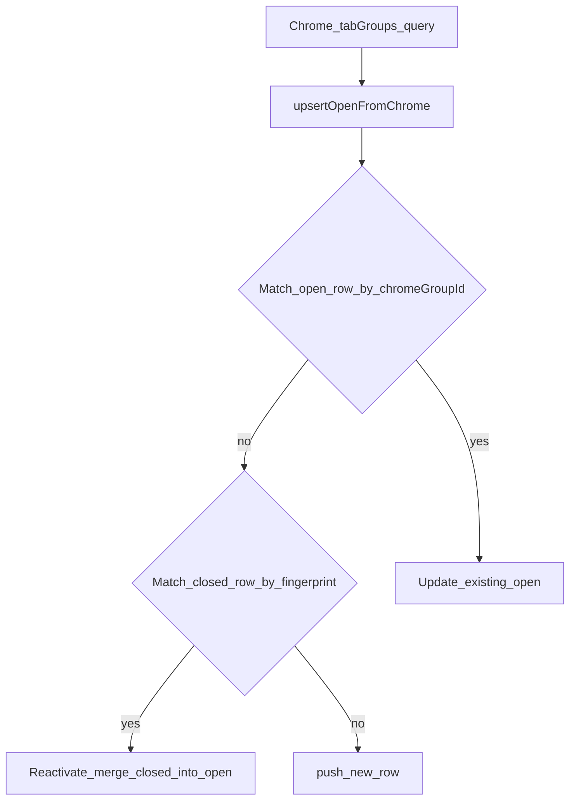

# Development plan: Tab group switcher — dedupe open vs closed registry rows

## Objective and current situation

**Objective:** The tab group switcher must show **at most one row per logical group**: if Chrome currently has an open tab group, there must not also be a separate **Closed / Restore** row that represents the same group.

**Current situation (user-visible):** The overlay lists six rows but only three distinct names — each group appears once as **Open** and again as **Closed** (with Restore / Saved URLs), matching duplicate persisted registry rows.

## Root cause (code review)

The snapshot builder emits **one UI row per `PersistedTabGroup` in storage**:

```107:137:chrome-extension/src/background/tab-group-registry.ts
	for (const p of state.groups) {
		if (p.isOpen && p.chromeGroupId != null) {
			const cg = chromeById.get(p.chromeGroupId);
			if (!cg) {
				continue;
			}
			const tabs = await chrome.tabs.query({ groupId: cg.id });
			rows.push({
				persistKey: p.persistKey,
				chromeGroupId: cg.id,
				title: cg.title || 'Untitled',
				color: cg.color,
				isOpen: true,
				tabCount: tabs.length,
				closedAt: null,
				hasRestorableUrls: false,
			});
		} else if (!p.isOpen) {
			const captured = p.urls ?? [];
			rows.push({
				persistKey: p.persistKey,
				chromeGroupId: null,
				title: p.title || 'Untitled',
				color: p.color,
				isOpen: false,
				tabCount: p.tabCount,
				closedAt: p.closedAt,
				hasRestorableUrls: captured.length > 0,
			});
		}
	}
```

Duplicates arise because **`upsertOpenFromChrome` only merges into rows that are still open with the same Chrome group id**:

```42:74:packages/storage/lib/impl/all-tab-groups-registry-storage.ts
	upsertOpenFromChrome: async (group: chrome.tabGroups.TabGroup, tabCount: number) => {
		await storage.set(prev => {
			const groups = [...prev.groups];
			const idx = groups.findIndex(g => g.isOpen && g.chromeGroupId === group.id);
			const now = Date.now();
			if (idx >= 0) {
				groups[idx] = {
					...groups[idx],
					title: group.title || 'Untitled',
					color: group.color,
					windowId: group.windowId,
					tabCount,
					urls: groups[idx].urls ?? [],
					lastSeenAt: now,
					isOpen: true,
					closedAt: null,
					chromeGroupId: group.id,
				};
			} else {
				groups.push({
					persistKey: newPersistKey(),
					chromeGroupId: group.id,
					windowId: group.windowId,
					title: group.title || 'Untitled',
					color: group.color,
					tabCount,
					urls: [],
					isOpen: true,
					closedAt: null,
					createdAt: now,
					lastSeenAt: now,
				});
			}
			return { ...prev, groups: pruneToCap(groups) };
		});
	},
```

After **`markClosedFromRemovedGroup`**, the row becomes **`isOpen: false`** and **`chromeGroupId: null`**. When the user opens/recreates a tab group in Chrome, Chrome assigns a **new** numeric **`group.id`**. The findIndex finds **no** matching open row, so the **`else` branch pushes a second persisted row**. The **old closed row remains** → **two entries** (open + closed) for what the user considers one group.

```79:117:packages/storage/lib/impl/all-tab-groups-registry-storage.ts
	markClosedFromRemovedGroup: async (
		group: chrome.tabGroups.TabGroup,
		tabCount: number,
		urlsSnapshot?: string[],
	) => {
		await storage.set(prev => {
			const groups = [...prev.groups];
			const idx = groups.findIndex(g => g.isOpen && g.chromeGroupId === group.id);
```

So the bug is **storage semantics**, not only UI sorting.

## Technical approach — options

### Option A — Presentation-layer dedupe only (`buildSwitcherSnapshot`)

Filter or collapse rows where an **open** row exists whose fingerprint `(windowId, title, color, tabCount)` matches a **closed** row.

- **Pros:** Small diff; fixes UI immediately for legacy duplicates.
- **Cons:** Leaves orphan persisted rows; ambiguity when two closed rows match one open group or identical titles across windows.

### Option B — Reconcile closed row when Chrome reports open (`upsertOpenFromChrome`) — **recommended**

Before **`groups.push(...)`**, look for a **closed** row in the **same window** that matches a defined fingerprint (e.g. normalized **`title` + `color` + `tabCount`**, optionally **recent `closedAt`** threshold):

1. **Reactivate** that row: `isOpen: true`, set **`chromeGroupId`** to the live Chrome id, clear **`closedAt`**, refresh **`tabCount`/`title`/`color`** from Chrome.
2. Optionally retain **`urls`** as archival snapshot until next close (product decision).

- **Pros:** Single persisted identity over “close → reopen” lifecycle; list stays consistent long-term.
- **Cons:** Heuristic — wrong merge if user had two different closed groups with same title/color/count (mitigate with `windowId` + ordering/time).

### Option C — Stable logical IDs separate from Chrome group id

Introduce `logicalGroupKey` (UUID) written at first sight; carry across close/reopen by explicit user actions only.

- **Pros:** Precise matching.
- **Cons:** Larger schema + migration; overkill for current symptom.

### Chosen direction

Implement **Option B** as primary fix (storage merge / reactivation), with **optional Option A** as a one-time **migration pass** or **defensive filter** in `buildSwitcherSnapshot` to hide legacy duplicates until storage is cleaned.

## Architecture / data flow (target)



## Implementation phases

1. **Define fingerprint helper** — `sameWindow`, normalized title (`trim`, collapse whitespace or case policy), `color`, `tabCount`. Document edge cases.
2. **Extend `upsertOpenFromChrome`** — try closed-row match before `push`; implement reactivation.
3. **Optional cleanup** — one-shot dedupe/migration: drop or merge duplicate closed rows already in storage (same fingerprint + window, keep newest closed vs discard).
4. **Optional defensive dedupe** in `buildSwitcherSnapshot` — omit closed row when open row wins fingerprint tie-break **within same window**.
5. **Tests / manual QA** — close group → recreate tabs/group → verify single row; two groups same name different counts remain distinct.

## Success metrics

| Type | Metric |
|------|--------|
| Qualitative | No screenshot-style duplicates for typical close→reopen flows within same window. |
| Qualitative | Legitimate distinct groups (different counts/colors/windows) still show separately. |
| Quantitative | `state.groups` count does not grow unbounded when repeatedly toggling the same named group (manual soak). |

## Risks

- **False merge:** Same window, same title/color/tabCount for unrelated sequential closes/reopens — reduce risk via **`closedAt` recency** window or prefer merge only when **single** closed candidate matches.
